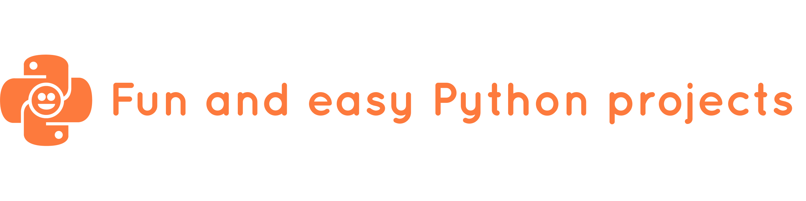

# Fun and easy Python projects
This is a collection of little Python projects for absolute beginners that are fun and easy. Perfect for parents to introduce their children to programming.

## __What is Python?__
*Python* was created by Guido van Rossum during 1985 - 1990 and it is named after a 1970s BBC comedy series called [*"Monty Python's Flying Circus"*](https://en.wikipedia.org/wiki/Monty_Python%27s_Flying_Circus). 
It is a *high-level*, *interpreted* programming language. Now, what does that mean? Computers do not speak our human language; they run on machine code. "High-level" programming languages were made so that it is easier for humans to write computer programs. Those programming languages are much closer to our human language than to machine code and therefore can be learned much easier. But because computers only run on machine code, they cannot directly understand high-level programming languages. If we want a computer to understand our code, we have mainly two options: use a *compiler* or use an *interpreter*. The difference between a compiler and an interpreter working with your code is the same difference as between a human translator and a human interpreter working on a message. The translator receives the message, then translates the whole thing before giving it to the recipient. The interpreter translates the message while receiving it, and passes it on to the recipient at the same time.
So, Python being an *interpreted* language means that you need to install a Python interpreter on your computer to interpret your code every time you want your computer to run one of your programs. 
There are two different versions of Python commonly used today: Python 2 and Python 3. We will be working with Python 3.

## __Prerequisites__
For the projects here you will need two things on your computer:

* the Python 3 interpreter,
* a software with which you can write your code: Visual Studio Code.

### __Installing the Python 3 interpreter__
To install the Python 3 interpreter, you can follow the installation guide for your operating system:

Installing Python on [Windows]() 
Installing Python on [Mac]() 
Installing Python on [Linux]() 

### __Installing Visual Studio Code__
[Visual Studio Code](https://code.visualstudio.com/) is a free code editor from Microsoft. To install it, you can follow the installation guide for your operating system:

Installing VS Code on [Windows]() 
Installing VS Code on [Mac]() 
Installing VS Code on [Linux]() 

## __Author__

**Elisabeth Strunk** 
 https://github.com/ElisabethStrunk 
 https://www.linkedin.com/in/elisabeth-strunk/

## __Acknowledgments__

* Many thanks to [Billie Thompson](https://gist.github.com/PurpleBooth) who provides a [template](https://gist.github.com/PurpleBooth/109311bb0361f32d87a2) for readmes that I used to write this readme